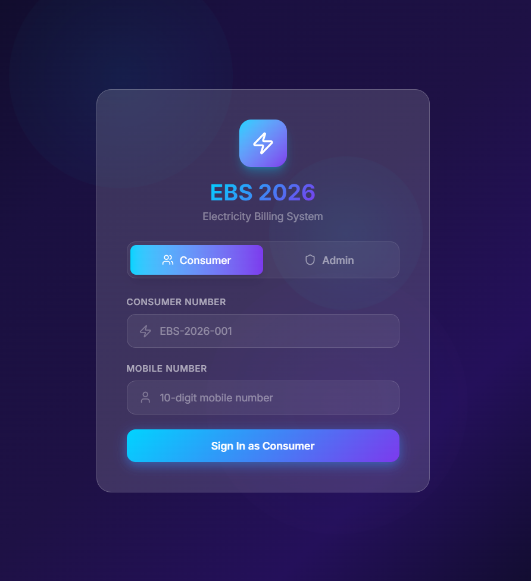

# ⚡ Electricity Billing System (EBS 2026)


A modern, full-featured electricity billing management system with a stunning glassmorphism UI. Built with React, TypeScript, and Tailwind CSS.

<div align="center">

### 🌐 [✨ View Live Demo →](https://electricity-billing-system-hazel.vercel.app/)

<a href="https://electricity-billing-system-hazel.vercel.app/">
  
</a>

<br/>

[](https://electricity-billing-system-hazel.vercel.app/)

</div>

## ✨ Features

### 🔐 Dual Login System
- **Admin Portal** - Full system management
- **Consumer Portal** - Self-service for customers

### 👨‍💼 Admin Features
- 📊 **Dashboard** - Real-time analytics with interactive charts
- 👥 **Consumer Management** - Add, edit, delete consumers
- 📄 **Billing System** - Generate bills with tiered pricing
- 💳 **Payment Processing** - Multiple payment modes
- 📝 **Complaint Management** - Track and resolve issues
- 📈 **Reports & Analytics** - Revenue trends, consumer insights
- ⚙️ **Settings** - Theme, notifications, system config

### 👤 Consumer Features
- 🏠 **Dashboard** - View dues, recent bills
- 📄 **My Bills** - View and pay bills online
- 💳 **Payment History** - Track all transactions
- 📝 **Complaints** - Submit and track issues
- 👤 **Profile** - View account details

### 🎨 UI/UX
- 🌓 **Dark/Light Mode** - Toggle themes
- 💎 **Glassmorphism Design** - Modern frosted glass effects
- 📱 **Fully Responsive** - Mobile-first design
- ✨ **Smooth Animations** - Polished user experience
- 🔔 **Toast Notifications** - Real-time feedback

## 🛠️ Tech Stack

| Technology | Purpose |
|------------|---------|
| React 19 | UI Framework |
| TypeScript | Type Safety |
| Tailwind CSS 4 | Styling |
| Vite | Build Tool |
| Recharts | Data Visualization |
| Lucide React | Icons |

## 📦 Installation

### Prerequisites
- Node.js 18+ 
- npm or yarn

### Setup

```bash
# Clone the repository
git clone https://github.com/yourusername/electricity-billing-system.git

# Navigate to project directory
cd electricity-billing-system

# Install dependencies
npm install

# Start development server
npm run dev

# Build for production
npm run build
```

## 🚀 Usage

### Development
```bash
npm run dev
```
Open [http://localhost:5173](http://localhost:5173) in your browser.

### Production Build
```bash
npm run build
npm run preview
```

## 💰 Billing Rate Structure

| Slab | Units | Rate (₹/unit) |
|------|-------|---------------|
| 1 | 0 - 100 | ₹5.00 |
| 2 | 101 - 300 | ₹7.00 |
| 3 | 301 - 500 | ₹9.00 |
| 4 | 500+ | ₹12.00 |

**Additional Charges:**
- Electricity Duty: 5%
- Fixed Charge: ₹50
- GST: 18%

## 📁 Project Structure

```
src/
├── components/
│   ├── LoginPage.tsx       # Dual login (Admin/Consumer)
│   ├── Sidebar.tsx         # Admin navigation
│   ├── Navbar.tsx          # Top header
│   ├── Dashboard.tsx       # Admin dashboard
│   ├── ConsumersPage.tsx   # Consumer CRUD
│   ├── BillingPage.tsx     # Bill generation
│   ├── PaymentsPage.tsx    # Payment processing
│   ├── ComplaintsPage.tsx  # Complaint management
│   ├── ReportsPage.tsx     # Analytics
│   ├── SettingsPage.tsx    # App settings
│   ├── ConsumerPortal.tsx  # Consumer self-service
│   └── Toast.tsx           # Notifications
├── App.tsx                 # Main app component
├── types.ts                # TypeScript interfaces
├── data.ts                 # Mock data & calculations
├── index.css               # Global styles
└── main.tsx                # Entry point
```

## 🎯 Roadmap

- [ ] Backend API integration
- [ ] Database connectivity (MySQL/PostgreSQL)
- [ ] Email notifications
- [ ] SMS alerts
- [ ] Payment gateway integration
- [ ] PDF bill generation
- [ ] Export reports (Excel/PDF)
- [ ] Multi-language support

## 🤝 Contributing

Contributions are welcome! Please feel free to submit a Pull Request.

1. Fork the repository
2. Create your feature branch (`git checkout -b feature/AmazingFeature`)
3. Commit your changes (`git commit -m 'Add some AmazingFeature'`)
4. Push to the branch (`git push origin feature/AmazingFeature`)
5. Open a Pull Request

## 📄 License

This project is licensed under the MIT License - see the [LICENSE](LICENSE) file for details.

## 👨‍💻 Author

**mainlypm0305**
- GitHub: [@mainlypm0305](https://github.com/mainlypm0305)
- Repo: [electricity-billing-system](https://github.com/mainlypm0305/electricity-billing-system)

---

## 🙏 Acknowledgments

- [React](https://react.dev/)
- [Tailwind CSS](https://tailwindcss.com/)
- [Recharts](https://recharts.org/)
- [Lucide Icons](https://lucide.dev/)

---

<p align="center">Made with ❤️ and ⚡</p>
